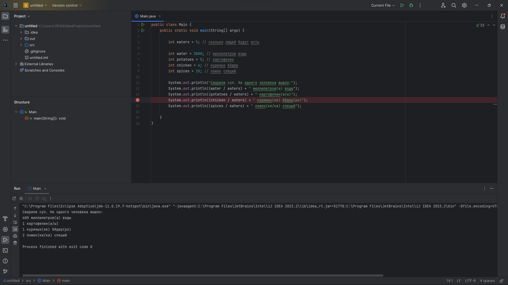

**<h2>Неверный расчёт порции куриных бедёр на одного человека</h2>**

**<h3>Описание</h3>**
При расчёте количества ингредиентов, количество куриных бедёр должно делиться между количеством людей 

**<h3>Локация дефекта</h3>**

        System.out.println((potatoes / eaters) + " картофелин(а/ы)");

**<h3>Шаги воспроизведения</h3>**

1. Открыть код программы в IDEA;
2. Выставить значение переменной eaters (количество людей) равной 5;
3. Выставить значение переменной water (миллитры воды) равной 3000;
4. Выставить значение переменной potatoes (миллитры воды) равной 5;
5. Выставить значение переменной chicken (миллитры воды) равной 6;
6. Выставить значение переменной spices (миллитры воды) равной 10;
7. Запустить програму;
8. Посмотреть на вывод в консоли программы.

*Ожидаемый результат*: Вывод сообщения о рассчёте куриных бедёр на каждого человека в колличестве 1,2 штук

*Фактический результат*: Вывод сообщения о рассчёте куриных бедёр на каждого человека в колличестве 1 штуки

**<h3>Скриншот</h3>**

**<h3>Окружение</h3>**

- **Операционная система**: Windows 11
- **IDE** IntelliJ IDEA 2023.2 
- **Java**: OpenJDK 11
